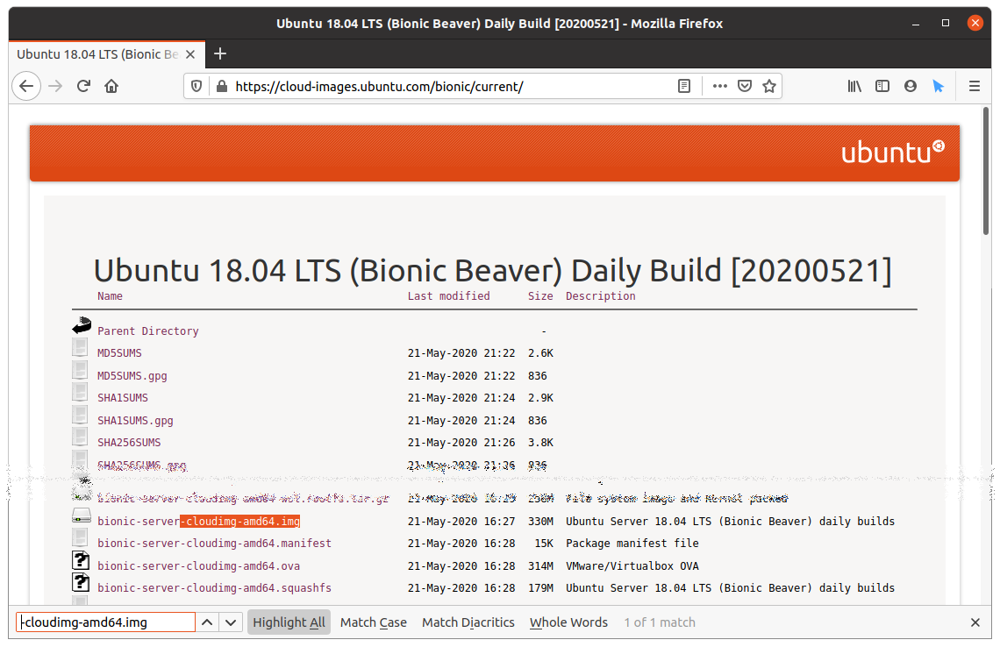

# VM インスタンスの作成

## はじめに

- VM インスタンス: 実際に出来上がる VM の実体
  - クラスを new したもの
  - クラス: この手順書
  - オブジェクト: Linux サーバ
- プラットフォーム
  - Ubuntu 20.04 LTS
  - qemu-kvm

## 用語の定義

| 用語 | 意味 | Example | メモ |
| ---- | ---- | ---- | ---- |
| `<dev-host>` | 作業ホスト | `kvm-01` | 読み替える |
| `<dev-user>` | 作業ユーザ | `dev-01` | 読み替える |
| `<instance>` | VM インスタンスのホスト名 | `ubu1804x01` | 読み替える |
| `<username>` | VM インスタンスに作成するユーザ名 | `mevi` | 読み替える |
| `<password>` | VM インスタンスのユーザに設定するパスワード | `mevi!1234` | 読み替える |
| `<passphrase>` | 秘密鍵に設定するパスフレーズ(空は非推奨) | `mevi 12345` | 読み替える |
| `/var/opt/cloudimgs` | .img ファイルを保存する PATH || 読み替え可 |
| `/var/opt/cloudimgs/cloud-configs` | cloud-config 関連ファイルを保存する PATH || 読み替え可 |
| `/var/opt/isos` | .iso ファイルを保存する PATH || 読み替え可 |
| `/var/opt/vm01` | VM インスタンスの実体を保存する PATH || 読み替え可 |
| `vDisk` | 仮想ディスク || VM インスタンスが読み書きしている実体 |

## VM インスタンス作成手順

### Cloud Image ベース

- 今どきはコッチの手順を理解しておけば事足りる

#### 参考資料

  - [cloud-init に関する FAQ[access.redhat.com]](https://access.redhat.com/ja/articles/1460743)
  - [Cloud config examples[cloudinit.readthedocs.io]](https://cloudinit.readthedocs.io/en/latest/topics/examples.html)
  - [Manage virtual machines with virt-manager[virt-manager.org]](https://virt-manager.org/)

#### Cloud Image を入手

- Ubuntu Cloud Image
  - https://cloud-images.ubuntu.com/bionic/current/ (Ubuntu 18.04 LTS)
    - bionic-server-cloudimg-amd64.img
    - SHA256SUMS
    
  - https://cloud-images.ubuntu.com/focal/current/ (Ubuntu 20.04 LTS) ※ Optional
- ディレクトリに配置
  ```bash
  $ sudo mkdir /var/opt/cloudimgs; cd $_
  $ sudo mv -i ~/Downloads/bionic-server-cloudimg-amd64.img .
  $ sudo mv -i ~/Downloads/SHA256SUMS ./bionic-server-cloudimg_20200521.sha256sum
  $ sudo chown root. ./bionic-server-cloudimg*
  ```
- ハッシュ値を照合
  ```bash
  $ sha256sum -c bionic-server-cloudimg_20200521.sha256sum 2>/dev/null | grep OK$
  bionic-server-cloudimg-amd64.img: OK
  ```
- ファイル名を変更
  ```bash
  $ sudo mv -i bionic-server-cloudimg-amd64{,_20200521}.img
  ```
- 詳細を確認  
  ファイル名(拡張子)は `.img` だが `file format: qcow2` と表示される事を確認します。
  ```bash
  $ qemu-img info ./bionic-server-cloudimg-amd64_20200521.img
  image: ./bionic-server-cloudimg-amd64_20200521.img
  file format: qcow2                         # <== ココ
  virtual size: 2.2 GiB (2361393152 bytes)
  disk size: 330 MiB
  cluster_size: 65536
  Format specific information:
      compat: 0.10
      refcount bits: 16
  ```

#### VM インスタンス用 vDisk を作成

- 変数の定義
  ```bash
  $ VM_HOSTNAME='<instance>'
  $ VDISK="/var/opt/vm01/${VM_HOSTNAME}.qcow2"
  ```
- Cloud Image から vDisk を作成
  ```bash
   $ sudo cp -ip ./bionic-server-cloudimg-amd64_20200521.img ${VDISK}
  ```
- 任意のサイズに拡張  
  `qemu-img resize` は入れ物の外枠を拡張したのみでパーティションやファイルシステムの拡張は
  VM インスタンス起動時に cloud-init の `growpart` と `resizefs` モジュールが実施します。  
  つまり使用する Cloud Image がモジュールを読み込んでいなければ意図した動作とはなりません。  
  なお拡張は可能でも縮小は推奨しません。
  ```bash
  $ sudo qemu-img resize ${VDISK} 16384M
  Image resized.
  ```
  `qemu-img info` コマンドで `virtual size:` が意図した値である事を確認します。  
  ```bash
  $ sudo qemu-img info ${VDISK} 
  image: /var/opt/vm01/<instance>.qcow2
  file format: qcow2
  virtual size: 16 GiB (17179869184 bytes)  # <== ココ
  disk size: 330 MiB
  cluster_size: 65536
  Format specific information:
      compat: 0.10
      refcount bits: 16
  ```

#### cloud-config の作成

初期設定を実施する cloud-init に読み込ませる `cloud-config` ファイルを作成します。  
Cloud Image からそのままインスタンスを作成するとログインすら出来ないので必須作業となります。  
AWS や OpenStack 等でも同様な手順で初期設定が可能なので(元々の名称は `ec2-init`)色々便利です。  
と言うか AWS や OpenStack 側で既に馴染みがあるならそのまま qemu-kvm で使える事だけ知っておけば良い。

- Key Pair の作成  
  SSH公開鍵認証で使用する秘密鍵ペアを作成します。既存の秘密鍵ペアを流用する場合はスキップして下さい。
  - ed25519  
    sshd のバージョン(openssh > 6.5)が許す限り意識高めに Ed25519 で作成します。
    ```bash
    $ ssh-keygen -t ed25519 -f ~/.ssh/id_ed25519_mevi_$(hostname -s)_$(whoami) -C "$(whoami)@$(hostname -s)"
    Generating public/private ed25519 key pair.
    Enter passphrase (empty for no passphrase): <passphrase>
    Enter same passphrase again: <passphrase>
    Your identification has been saved in /home/<dev-user>/.ssh/id_ed25519_mevi_<dev-host>_<dev-user>
    Your public key has been saved in /home/<dev-user>/.ssh/id_ed25519_mevi_<dev-host>_<dev-user>.pub
    The key fingerprint is:
    SHA256:780MFklryB3NzPvS9wqc+TsjpSoqfLOf+7g1SByEgIA <dev-user>@<dev-host>
    (..snip..)
    ```
  - [ToDo] ecdsa{256,384,521}  
    検索していると偶に "PuTTY で未サポート" とか見かけますがドキュメント上は使える事になっています(私は PuTTY 派じゃないので未検証)。
  - [ToDo] rsa4096  
    2020年時点での最低ライン。今から新規で `rsa2048` は意識低いです。
- 変数の定義
  ```bash
  $ VM_USERNAME='<username>'
  $ VM_PASSWORD='<password>'
  ```
- cloud-config ファイルの作成
  - meta-data
    ```bash
    $ sudo mkdir -p /var/opt/cloudimgs/cloud-configs/${VM_HOSTNAME}; cd $_
    $ sudo chown <dev-user>. /var/opt/cloudimgs/cloud-configs{,/${VM_HOSTNAME}}
    $ cat <<EOF > ./meta-data
    > instance-id: $(uuidgen)
    > local-hostname: ${VM_HOSTNAME}
    > 
    > EOF
    ```
  - user-data
    ```bash
    $ cat <<EOF > ./user-data
    > #cloud-config
    > 
    > hostname: ${VM_HOSTNAME}
    > preserve_hostname: true
    > timezone: Asia/Tokyo
    > ssh_pwauth: False
    > 
    > users:
    >   - name: ${VM_USERNAME}
    >     groups:
    >       - adm
    >       - sudo
    >     shell: /bin/bash
    >     ssh_authorized_keys:
    >       - $(cat ~/.ssh/id_ed25519_mevi_$(hostname -s)_$(whoami).pub)
    > 
    > chpasswd:
    >   list: |
    >       ${VM_USERNAME}:${VM_PASSWORD}
    >   expire: False
    > 
    > runcmd:
    >   - systemctl restart rsyslog.service
    > 
    > EOF
    ```
- ISO イメージの作成  
  作成した cloud-config を含んだ ISO ファイルを作成します。
  ```bash
  $ genisoimage -input-charset utf-8 -output ./$(basename $(pwd)).iso -volid cidata -joliet -rock user-data meta-data
  Total translation table size: 0
  Total rockridge attributes bytes: 331
  Total directory bytes: 0
  Path table size(bytes): 10
  Max brk space used 0
  183 extents written (0 MB)
  $ file ./$(basename $(pwd)).iso
  ./<instance>.iso: ISO 9660 CD-ROM filesystem data 'cidata'
  ```
  ```bash
  $ sudo mount ./$(basename $(pwd)).iso --types iso9660 /media
  $ more /media/{meta-data,user-data}
  $ sudo umount /media
  ```

#### スニペット (user-data)

- apt proxy
  ```
  apt:
    http_proxy: http://[[user][:pass]@]host[:port]/
    ftp_proxy: ftp://[[user][:pass]@]host[:port]/
    https_proxy: https://[[user][:pass]@]host[:port]/
  ```

#### スニペット (network-config)

- netplan  
  通常の `netplan.yaml` からトップレベルの `network:` を削って、その配下のキーをトップレベルに移動した書式で記述して下さい。
  ```bash
  $ cat ./network-config 
  version: 2
  ethernets:
    enp1s0:
      dhcp4: false
      addresses: 
        - 172.31.250.102/24
      gateway4: 172.31.250.254
      nameservers:
        addresses: 
          - <NameServer1>
          - <NameServer2>
      dhcp6: false
  $ genisoimage -input-charset utf-8 -output ./$(basename $(pwd)).iso -volid cidata -joliet -rock \
  > user-data meta-data network-config
  ```

#### VM インスタンスの作成

作成した ISO イメージを指定してVM インスタンスを作成します。  
- Network の確認  
  定義済みの Network 名を確認します。例で指定している `default` は libvirt が作成した NAPT Network です。
  ```bash
  $ virsh net-list
   Name         State    Autostart   Persistent
  -----------------------------------------------
   br_kvm0250   active   yes         yes
   default      active   yes         yes              # <== ココ
  
  $ virsh net-info default
  Name:           default
  UUID:           bb4bd589-b304-42ba-ac93-dae892e9a660
  Active:         yes
  Persistent:     yes
  Autostart:      yes
  Bridge:         virbr0                              # <== ココ
  
  $ ip addr show virbr0
  6: virbr0: <NO-CARRIER,BROADCAST,MULTICAST,UP> mtu 1500 qdisc noqueue state DOWN group default qlen 1000
      link/ether 52:54:00:39:66:54 brd ff:ff:ff:ff:ff:ff
      inet 192.168.122.1/24 brd 192.168.122.255 scope global virbr0
         valid_lft forever preferred_lft forever
  ```
- VM インスタンスの作成  
  - `virt-install` コマンドオプション
    
    | Options | Comment | Example |
    | --- | --- | --- |
    | `--name` | KVM(libvirt)の世界の中での domain 名| `ubu1804x01` |
    | `--metadata description=` | 任意のコメント文 | `Test` |
    | `--ram` | VM インスタンスに割り当てるメモリ量を `MiB` 単位で指定 | `2048` | 
    | `--vcpus` | VM インスタンスに割り当てる vCPU コア数を整数で指定 | `2` |
    | `--arch` | シミュレートする CPU アーキテクチャを指定 | `x86_64` |
    | `--os-variant` | qemu 最適化の為に `$ osinfo-query os` 一覧の中から選択 | `ubuntu20.04`, `centos8`, `fedora31`, `freebsd9.3`, `rhl9`, `win10` |
    | `--hvm` | 完全仮想化オプション ||
    | `--virt-type` | 使用するハイパーバイザを指定 | `kvm`, `qemu`, `xen` |
    | `--disk path=` | vDisk の PATH を指定 | `/var/opt/vm01/hoge.img`,`/dev/mapper/VolGroup99-LogVol99` |
    | `--disk format=` | vDisk の Format を指定 | `raw`, `qcow2`, `vmdk` |
    | `--boot` | インストール後のブートデバイスを指定 | `hd`, `cdrom`, `network`, `uefi` |
    | `--network network=` | libvirt で作成済みの network を指定 | `default` |
    | `--network bridge=` | OS で作成済みの bridge を指定 | `br_backend` |
    | `--network model=` | ドライバ を指定 | `e1000`, `rtl8139`, `virtio` |
    | `--graphics` | コンソールの出力先を指定 | `none`, `vnc` |
    | `--serial` | シリアルポートの接続先を指定 | `pty` |
    | `--console` | virtio コンソールの出力先を指定 | `pty`|
    | `--clock offset=` | 物理マシンと仮想マシンの時刻差を設定 | `utc` |
    | `--clock rtc_tickpolicy=` | 時刻合わせの速度のポリシーを設定 | `catchup`, `merge` |
    | `--import` | インストールプロセスをスキップし `--disk` で 指定した vDisk から起動するオプション ||

  - `virt-install` コマンド実行イメージ
     ```bash
     $ virt-install --name ${VM_HOSTNAME} \
     > --metadata description="test: cloud-img/cloud-config" \
     > --ram 512 --vcpus 1 --arch x86_64 --os-variant ubuntu18.04 --hvm --virt-type kvm \
     > --disk path="${VDISK},format=qcow2" \
     > --disk path="$(pwd)/${VM_HOSTNAME}.iso" \
     > --boot hd --network network="default,model=virtio" \
     > --graphics none --serial pty --console pty --clock offset=utc,rtc_tickpolicy=catchup --import
    WARNING  Requested memory 512 MiB is less than the recommended 2048 MiB for OS ubuntu18.04
    
    Starting install...
    Connected to domain <instance>
    Escape character is ^]
    [    0.000000] Linux version 4.15.0-101-generic (buildd@lgw01-amd64-003) (gcc version 7.5.0 (Ubuntu 7.5.0-3ubuntu1~18.04)) #102-Ubuntu SMP Mon May 11 10:07:26 UTC 2020 (Ubuntu 4.15.0-101.102-generic 4.15.18)
    [    0.000000] Command line: BOOT_IMAGE=/boot/vmlinuz-4.15.0-101-generic root=LABEL=cloudimg-rootfs ro console=tty1 console=ttyS0
    (..snip..)
    [  OK  ] Started Wait for Network to be Configured.
             Starting Initial cloud-init job (metadata service crawler)...
    [   14.695544] cloud-init[655]: Cloud-init v. 19.4-33-gbb4131a2-0ubuntu1~18.04.1 running 'init' at Sun, 24 May 2020 09:32:26 +0000. Up 14.47 seconds.
    [   14.699097] cloud-init[655]: ci-info: ++++++++++++++++++++++++++++++++++++++Net device info++++++++++++++++++++++++++++++++++++++
    [   14.704356] cloud-init[655]: ci-info: +--------+------+----------------------------+---------------+--------+-------------------+
    [   14.706025] cloud-init[655]: ci-info: | Device |  Up  |          Address           |      Mask     | Scope  |     Hw-Address    |
    [   14.708733] cloud-init[655]: ci-info: +--------+------+----------------------------+---------------+--------+-------------------+
    [   14.712947] cloud-init[655]: ci-info: | enp1s0 | True |      192.168.122.188       | 255.255.255.0 | global | 52:54:00:4c:36:5a |  # <== ココ
    [   14.715383] cloud-init[655]: ci-info: | enp1s0 | True | fe80::5054:ff:fe4c:365a/64 |       .       |  link  | 52:54:00:4c:36:5a |
    [   14.718650] cloud-init[655]: ci-info: |   lo   | True |         127.0.0.1          |   255.0.0.0   |  host  |         .         |
    [   14.720176] cloud-init[655]: ci-info: |   lo   | True |          ::1/128           |       .       |  host  |         .         |
    [   14.723457] cloud-init[655]: ci-info: +--------+------+----------------------------+---------------+--------+-------------------+
    (..snip..)
    ci-info: Authorized keys from /home/<username>/.ssh/authorized_keys for user <username>  # <== ココ
    ci-info: +---------+-------------------+---------+---------+
    ci-info: | Keytype | Fingerprint (md5) | Options | Comment |
    ci-info: +---------+-------------------+---------+---------+
    ci-info: +---------+-------------------+---------+---------+
    (..snip..)
    [   30.005237] cloud-init[1062]: Cloud-init v. 19.4-33-gbb4131a2-0ubuntu1~18.04.1 running 'modules:final' at Sun, 24 May 2020 13:31:16 +0000. Up 29. 64 seconds.
    [   30.007240] cloud-init[1062]: Cloud-init v. 19.4-33-gbb4131a2-0ubuntu1~18.04.1 finished at Sun, 24 May 2020 13:31:16 +0000. Datasource  DataSourceNoCloud [seed=/dev/vdb][dsmode=net].  Up 29.99 seconds
    
    Ubuntu 18.04.4 LTS <instance> ttyS0
    
    <instance> login: 
    ```
- ssh ログイン  
  `Ctrl+]` でコンソール接続から抜けるか、別端末から実施します。
  ```bash
  $ virsh domifaddr ${VM_HOSTNAME}
   Name       MAC address          Protocol     Address
  -------------------------------------------------------------------------------
   vnet0      52:54:00:4c:36:5a    ipv4         192.168.122.188/24                 # <== ココ
  ```
  ```bash
  $ ssh -l ${VM_USERNAME} -i ~/.ssh/id_ed25519_mevi_$(hostname -s)_$(whoami) 192.168.122.188
  The authenticity of host '192.168.122.188 (192.168.122.188)' can't be established.
  ECDSA key fingerprint is SHA256:B5zyYWIycYTc9iGEXYpp8Rj4NPipZ7UI6tHLyve6m74.
  Are you sure you want to continue connecting (yes/no/[fingerprint])? yes
  Warning: Permanently added '192.168.122.188' (ECDSA) to the list of known hosts.
  Enter passphrase for key '/home/<dev-user>/.ssh/id_ed25519_mevi_<dev-host>_<dev-user>': <passphrase>
  Welcome to Ubuntu 18.04.4 LTS (GNU/Linux 4.15.0-99-generic x86_64)
  (..snip..)
  <instance>@<username>:~$ 
  ```

#### cloud-config 反映の確認

- hostname
  ```bash
  $ hostname
  <instance>
  ```
- timezone
  ```bash
  $ ls -l /etc/localtime 
  lrwxrwxrwx 1 root root 30 May 24 22:31 /etc/localtime -> /usr/share/zoneinfo/Asia/Tokyo
  ```
- users: name
  ```bash
  $ whoami
  <username>
  ```
- users: groups
  ```bash
  $ id
  uid=1000(<username>) gid=1000(<username>) groups=1000(<username>),4(adm),27(sudo)
  ```
- users: shell
  ```bash
  $ echo ${SHELL}
  /bin/bash
  ```
- 任意のサイズに拡張
  ```bash
  $ df -h /
  Filesystem      Size  Used Avail Use% Mounted on
  /dev/vda1        16G  1.2G   15G   8% /
  ```
- apt proxy
  ```bash
  $ cat /etc/apt/apt.conf.d/90cloud-init-aptproxy 
  Acquire::http::Proxy "http://[[user][:pass]@]host[:port]/";
  Acquire::https::Proxy "http://[[user][:pass]@]host[:port]/";
  ```
- netplan (dhcp)
  ```bash
  $ grep -v -E ^"(#|$)" /etc/netplan/50-cloud-init.yaml 
  network:
      ethernets:
          enp1s0:
              dhcp4: true
              match:
                  macaddress: 52:54:00:75:89:ab
              set-name: enp1s0
      version: 2
  ```
- netplan (network-config)
  ```bash
  $ grep -v -E ^"(#|$)" /etc/netplan/50-cloud-init.yaml 
  network:
      ethernets:
          enp1s0:
              addresses:
              - 172.31.250.102/24
              dhcp4: false
              dhcp6: false
              gateway4: 172.31.250.254
              nameservers:
                  addresses:
                  - <NameServer1>
                  - <NameServer2>
      version: 2
  ```
- ssh_pwauth: False
  ```bash
  $ exit
  $ ssh -l ${VM_USERNAME} 192.168.122.188
  <username>@192.168.122.188: Permission denied (publickey).
  ```

#### cloud-config 用 .iso イメージの取り外し

上記手順で使用している cloud-config は初回起動時のみに動作し、再起動時には動作しません。  
逆に言うとイメージを取り外さなくとも悪影響は有りませんが無意味なので任意で実施します。
- デバイスの確認
  ```bash
  $ virsh domblklist ${VM_HOSTNAME} 
   Target   Source
  --------------------------------------------------------------------------------------------
   vda      /var/opt/vm01/<instance>.qcow2
   vdb      /var/opt/cloudimgs/cloud-configs/<instance>/<instance>.iso    # <== コレ
  ```
- 指定する引数の確認
  `<alias name='hoge'/>` はインスタンス起動時にのみ出力されます。
  ```bash
  $ virsh dumpxml ${VM_HOSTNAME} | grep -A5 -B2 $(basename $(pwd)).iso
      <disk type='file' device='disk'>
        <driver name='qemu' type='raw'/>
        <source file='/var/opt/cloudimgs/cloud-configs/<instance>/<instance>.iso' index='1'/>
        <backingStore/>
        <target dev='vdb' bus='virtio'/>                                             # <== コレ(detach-disk)
        <alias name='virtio-disk1'/>                                                 # <== コレ(detach-device-alias)
        <address type='pci' domain='0x0000' bus='0x04' slot='0x00' function='0x0'/>
      </disk>
  ```
- コンフィグからのデバイス削除
  ```bash
  $ virsh detach-disk ${VM_HOSTNAME} vdb --config
  Disk detached successfully
  ```
- 起動中 VM インスタンスからのデバイス削除
  ```bash
  $ virsh detach-device-alias ${VM_HOSTNAME} virtio-disk1
  Device detach request sent successfully
  ```
- 削除の確認(コンフィグ)  
  表示されない事を確認する。
  ```bash
  $ sudo grep $(basename $(pwd)).iso /etc/libvirt/qemu/<instance>.xml
  ```
- 削除の確認(VM インスタンス内)  
  VM インスタンスへログインして `vdb` が表示されない事を確認する。
  ```bash
  $ lsblk 
  NAME    MAJ:MIN RM  SIZE RO TYPE MOUNTPOINT
  vda     252:0    0    8G  0 disk 
  ├─vda1  252:1    0  7.9G  0 part /
  ├─vda14 252:14   0    4M  0 part 
  └─vda15 252:15   0  106M  0 part /boot/efi
  ```

#### VM インスタンスの削除

VM インスタンスが不要になったりcloud-config ファイルの内容を間違えてログインが出来ない場合等は以下で VM インスタンスを削除します。
- インスタンスの削除
  ```bash
  $ virsh shutdown ${VM_HOSTNAME}
  $ virsh list --all | grep -E "(^ Id|^----|${VM_HOSTNAME})"
   Id   Name         State
  -----------------------------
   -    <instance>   shut off
  $ virsh undefine ${VM_HOSTNAME}
  Domain <instance> has been undefined
  $ sudo rm -i ${VDISK}
  ```
- cloud-config.iso の退避  
ファイルの内容の間違えであれば削除(`rm`)として読み替えること。
  ```bash
  $ sudo mv -i /var/opt/cloudimgs/cloud-configs/${VM_HOSTNAME}/${VM_HOSTNAME}.iso{,.bak1}
  ```
- `~/.ssh/known_hosts` から VM インスタンスの情報を削除  
将来的に IPアドレスやホスト名を再利用または重複する事が想定されるならば予め削除する事を推奨します。
  ```bash
  $ ssh-keygen -R 192.168.122.188
  ```

### iso(インストールメディア)ベース

- Optional
- 昔はこれだった
- VM ではなく実サーバへのインストール手順に近い
- 環境依存度が高いが、言い換えるとどんな環境や要求仕様にも対応可能
